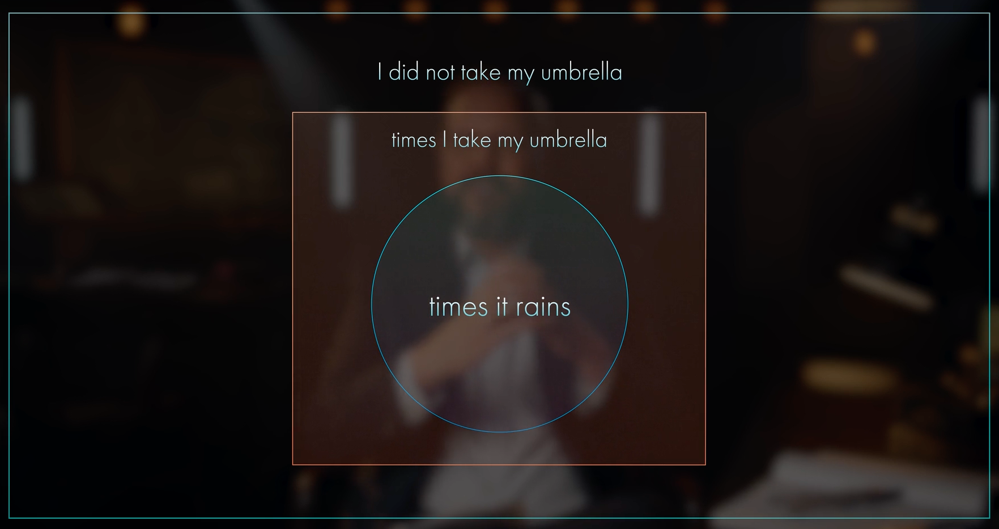
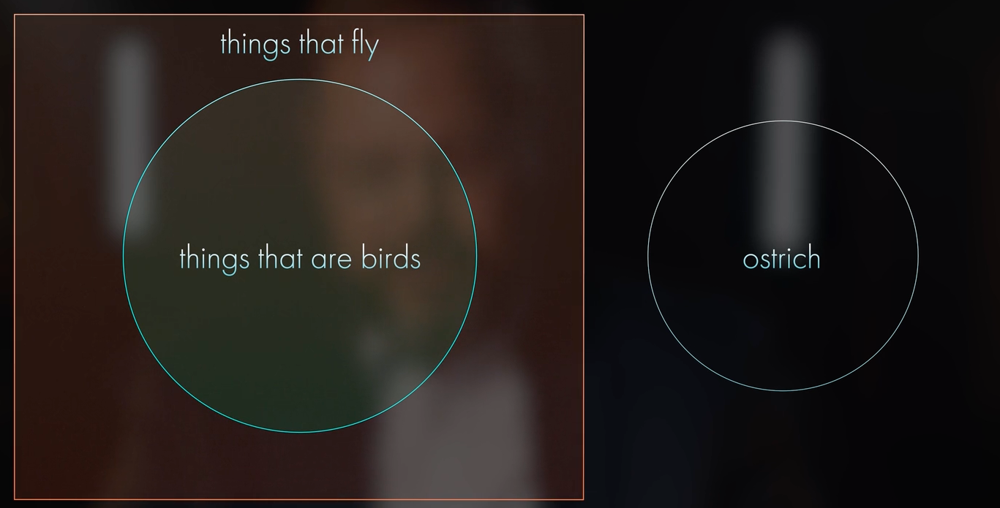
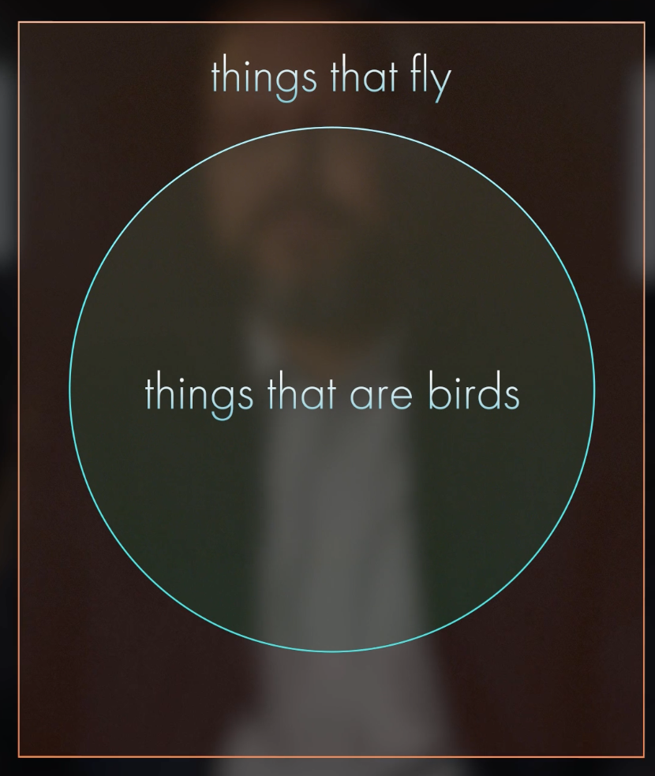
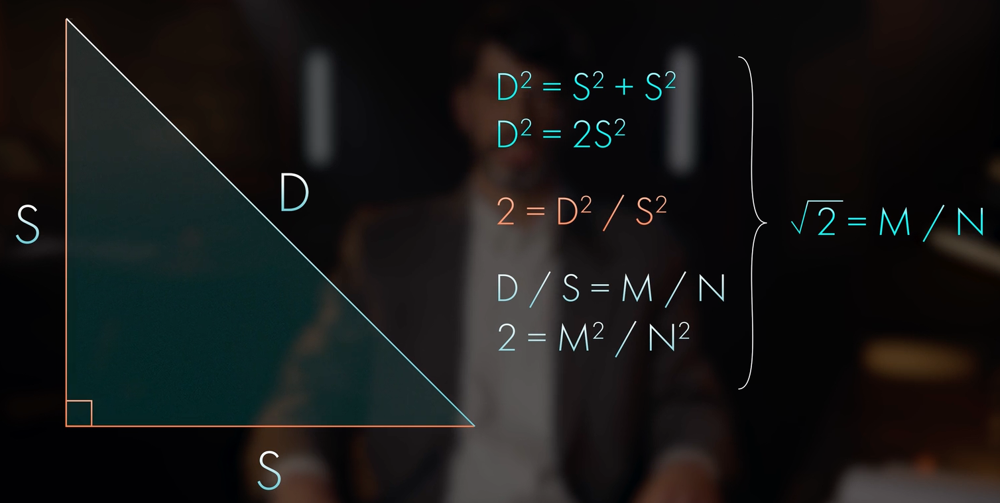
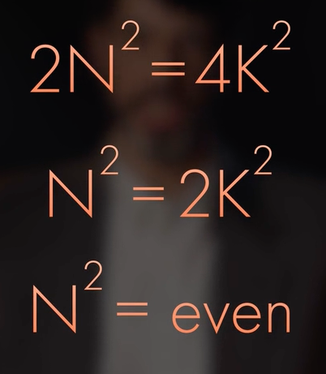

# Mathematics and Logic: From Euclid to Modern Geometry
https://online.hillsdale.edu/courses/mathematics-and-logic-from-euclid-to-modern-geometry

### Table of Contents

> * [Lesson 1. Mathematics and Liberal Education](#lesson-1-mathematics-and-liberal-education)
> * [Lesson 2. The Fundamentals of Logic](#lesson-2-the-fundamentals-of-logic)
> * [Lesson 2 Quiz](#lesson-2-quiz)
> * [Lesson 3. Deductive Reasoning and the Transformation of Mathematics](#lesson-3-deductive-reasoning-and-the-transformation-of-mathematics)
> * [Lesson 3 Quiz](#lesson-3-quiz)
> * [Lesson 4. Begin at the Beginning: The Axioms aog Euclidean Geometry](#lesson-4-begin-at-the-beginning-the-axioms-of-euclidean-geometry)
> * [Lesson 4 Quiz](#lesson-4-quiz)
> * [Lesson 5. Neutral Geometry: The Early Propositions of Euclid's Elements](#lesson-5-neutral-geometry-the-early-propositions-of-euclids-elements)
> * [Lesson 5 Quiz](#lesson-5-quiz)
> * [Lesson 6. Euclid's Fifth Postulate](#lesson-6-euclids-fifth-postulate)
> * [Lesson 6 Quiz](#lesson-6-quiz)
> * [Lesson 7. Euclid's Proof of the Pythagorean theorem](#lesson-7-euclids-proof-of-the-pythagorean-theorem)
> * [Lesson 7 Quiz](#lesson-7-quiz)
> * [Lesson 8. Number Theory and Solid Geometry in the Elements](#lesson-8-number-theory-and-solid-geometry-in-the-elements)
> * [Lesson 8 Quiz](#lesson-8-quiz)
> * [Lesson 9. Euler and the Birth of a New Geometry](#lesson-9-euler-and-the-birth-of-a-new-geometry)
> * [Lesson 9 Quiz](#lesson-9-quiz)
> * [Lesson 10. The History of the Fifth Postulate](#lesson-10-the-history-of-the-fifth-postulate)
> * [Lesson 10](#lesson-10)
> * [Lesson 11. Non-Euclidean Geometry](#lesson-11-non-euclidean-geometry)
> * [Lesson 11 Quiz](#lesson-11-quiz)
> * [Final Quiz](#final-quiz)

*** 

## Lesson 1. Mathematics and Liberal Education

## Lesson 2. The Fundamentals of Logic

### Statement
Statement = a sentence that is either true or false

- a question is not a statement
- we should be able to assign a truth value to it
- either true or false, not both, and not either 

Examples of statements

    The hat is red.

    The program failed.

### Negation
Negation = a statement that contains the opposite truth value of another statement.

    Statement:      The hat is red.
    Negation:       The hat is not red.

    Statement:      The program failed.
    Negation:       The program did not fail.

    Statement:      All men are mortal.
    Negation:       Some man is mortal.

    Statement:      The base anles are equal.
    Negation:       The base anles are not equal.

### Implications (if - then statements)
Examples of implications

    Statement 1:    It is a bird.
    Statement 2:    It flies.
    Implication:    If it is a bird, then it flies.

If P, then Q. / P implies Q.
* P - antecedent
* Q - consequent 

### Converse Statement
- Original statement: If Q, then P
- Converse statement: If P, then Q.

     If it flies, then it is a bird.
 
A converse is not logically equivalent to an implication:

### Inverse Statement 
Negation of both antecedent and consequent:

    Statement:      If P, then Q.
    Inverse:        If not P, not Q.

e.g.

    If it is not a bird, then it does not fly.

An inverse is not logically equivalent to an implication.

### Contrapositive
A statement that negates both the antecedent and the consequent, and then switches the order.

    Statement:          If it is a bird, then it flies
    Contrapositive:     If it does not fly, then it is not a bird.  // logically equivalent

    Statement:          If the money is not spent, then the program fails.
    Converse:           If the program fails, then the money is not spent.
    Inverse:            If the money is spent, then the pgoram does not fail.
    Contrapositive:     If the program does not fail, then the money is spent.  // logically equivalent

Implications are the building blocks for how we put our statements together to come up with an argument.

### Arguments

### Modus Ponens
Basic argument, affirming antecedent.

    Statement:                          All men are mortal.
    Mathematical if-then statement:     If it is a man, then he is mortal.
    Modus Ponens:                       If it is a man, then he is mortal.
                                        Socrates is a man. Therefore, Socrates is mortal.

### Modus Ponens > Fallacy
Fallacy = incorrect argument.

    Statement:                          If it is a man, then it is mortal.
                                        Flipper is not a man. Therefore, Flipper is not mortal.
                                        // Flipper (dolphin), absurd statement.

    // Fallaccy of denying the antecedent

### Modus Tollens
Denying the consequent

    If it rains, then I will take my umbrella.
    I did not take my unbrella. Therefore, it did not rain.

### Modus Tollens > Fallacy
Fallacy of affirming the consequent.

    If it rains, then I will take my umbrella.
    I took the umbrella. Therefore, it rained.  // not valid

### Negation of an Implication

#### Reduction ad Absurdium
A proof by contradiction.

    Original implication:       If it is a bird, then it flies.
                                
    // we'll need to find sth that is not a bird, but flies.

    Implication:            If P, then Q.
    Negation:               P = true; Q = not true

Logic - building blocks for reasoning:
- negation
- implication
- converse
- inverse
- contrapositive
- modus tollens
- modus ponens 

## Syllogistic Puzzle

    Everyone who is sane can do logic.
    No lunatics are fit to serve on a jury.
    None of your sons can do logic.

## Lesson 2 Quiz
### Q1.
Prior to the ancient Greeks, the ______ and ______ obtained new knowledge in mathematics primarily through trial and error.

    [+]  Egyptians; Babylonians
    []  Egyptians; Romans
    []  Romans; Babylonians
    []  Hebrews; Carthaginians

### Q2.
Beginning with ten self-evident assumptions, Euclid in his Elements demonstrated ______ propositions.

    []  13
    []  278
    [+]  465
    []  924

### Q3.
According to the principles of logic, a statement must be either true or false.

    [+]  True
    []  False 

### Q4.
The ______ is a statement that has the opposite truth value of our original statement.

    [+]  negation
    []  inverse
    []  converse
    []  contrapositive

### Q5.
An implication consists of a(n) ______ statement, whose two parts are called the antecedent and consequent, respectively.

    []  either/or
    []  both/and
    [+]  if/then
    []  just as/so also

### Q6.
The antecedent and consequent are switched in the ______ of a statement.

    []  inverse
    []  adverse
    []  reverse
    [+]     converse  

### Q7.
The inverse of the statement, “if it is a bird, then it flies,” is “if it is not a bird, then it does not fly.” These statements are logically equivalent.

    []   True 
    [+]  False

### Q8.
The contrapositive of the implication, “if P, then Q,” is ______.

    []  "if P, then not Q"
    []  "if Q, then P"
    [+]  "if not Q, then not P"
    []  "if not P, then not Q"

### Q9.
A conditional statement of the form "if P then Q" and its ______ are logically equivalent.

    [+]  contrapositive
    []  inverse
    []  converse
    []  none of the above

### Q10.
_____ is a proof that demonstrates the negation of an implication must be false.

    []  Modus tollens
    []  Modus ponens
    [+] Reduction ad absurdium  
    []  none of the above

## Lesson 3. Deductive Reasoning and the Transformation of Mathematics
Greeks transformed Maths.

### 3 Criteria for Maths
1. The objects of mathematics are abstract.
2. The foundation of mathematics is geometry.
3. The method of mathematics is deductive reasoning.

### Deductive Reasoning
The pursuit of logical consequences from a given system of initial universal truths.

Syllogism example

    All men are mortal.
    Socrates is a man.                  // this premis is particular
    Therefore, Socrates is mortal.      // conclusion is particular

Another example

    All men are mortal.                 // this premis is universal
    Angels are immortal.                // this premis is universal
    Therefore, men are not angels.      // conclusion is universal

### Advantages of Deductive Reasoning
1. It provides absolute certainty of result.
2. It demonstrates the necessary dependence of ideas with one another.

Inductive reasoning: argue from particulars to general (from observations to theory)

### Proof
A chain of statements, with justifications for each statement, that ends with a desired conclusion:
1. Direct proof.
2. Indirect proof (proof by contradiction or lat. - Reductio ad Absurdum)

### Direct Proof
A proof that uses only the given assumptions and statements that can be deduced from them in order to reach a conclusion.

### Indirect Proof
A proof that starts with the given assumptions, assumes that the desired conclusion is false, and derives a contradiction.

    "It is an old maxim of mine that when you have excluded the impossible,
    whatever remains, however improbable, must be the truth."
                    Arthur Conan Doyle "The Adventure of the Beryl Coronet"

### Law of the Excluded Middle by Aristotle
A statement is either true or false.

    "For nothing about things would be comprehensible to anybody, neither of 
    things  in themselves, nor of one in relation to the other, i number and its 
    essensce were nonexistent. ... The essense of number, like harmony, does not 
    allow misunderstanding, for this is starnge to it."

    "Deception and envy are inherent to the unbounded, unknowable, and unreasonable.
    ... Truth, however, is inherent in the nature of number and inbred in it."
                                    Philolaus, on the Universe, "Fragment 11"

More explicitly, 

    D / S = M / N

### Pythagorean theorem

True? No, it's not possible

### Starting Assumption

If we square both sides of the expression,

    2 = M^2 / N^2
    2N^2 = M^2

    If M^2 is even, then M itself must be even.

Exercise

    If M is odd, then M^2 must be odd.

M must be even (the only alternative). Then, M must be a multiple of 2. Then,

    M^2 = (2K)^2 = 4K^2

which is a contradiction:

    M is even
    N is even
    Both are divisible by 2
    2 is greater than 1

So, the starting assumption is false:

    sqrt 2 = M / N
    where M and N have no common divisor greater than 1     // false

Therefore, sqrt 2 is irrational.

### Types of numbers
1. Whole numbers (1, 2, 3, 4, 5, ...)
2. Integers (= whole numbers + their negatives)
3. Rational numbers (fractions: 2/3, 5/6, ...)
4. Irrational numbers (sqrt 2, cube root of 17, ...)
5. Transcendental numbers (PI - 3.141592653589793... , e - 2.71828...)

Numbers are insufficient means of describing the world of maths.

    sqrt 9 = 3
    sqrt 4 != 2, so number 2 is the source of irrationality

### Prime number
A number greater than 1 that is only divisible by 1 and itself
(indivisible quantities (atoms) of integers)

    prime   not prime
    ----------------
    17      6
    
### Fundamental Theorem of Arithmetic
Every integer greater than 1 can be written as a product of primes.

    50 | 5, 5, 2    // 50 is product of 5, 5, and 2

There are supposed to be numbers not on my list.

Supposed we have prime numbers:

    2, 3, 5, 7, 11, 13, 17, 19, ..., p
    multiply them and get a whole number
    whole number + 1 = Q
    Q must be divisible by some prime
    Q divided by any prime number on this list leaves a remainer of 1.

### Hardy's Criteria for Beauty
1. Economy
2. Inevitability
3. Unexpectedness 

### Hardy's Criteria for Seriousness
1. Significance ofo the results
2. Depth of the ideas
3. Generality of the notions involved

The availability of large prime numbers is a bedrock of RSA cryptography. 

## Lesson 3 Quiz
### Q1.
The ancient Greeks transformed mathematics in part by founding it upon _____.

    []  arithmetic
    []  algebra
    [+] geometry  
    []  calculus

### Q2.
______ reasoning is the pursuit of the logical consequences from a given system of initial universal truths.

    [+]  Deductive  
    []  Abductive
    []  Inductive
    []  Critical

### Q3.
The _____ tenet that “all is number” was upended by the irrationality of the √2.

    []  Platonist
    [+]  Pythagorean
    []  Aristotelian
    []  Epicurean
 
### Q4.
A(n) _____ is a number that cannot be expressed as a ratio of two whole numbers.

    []  integer
    [+]  irrational number
    []  rational number
    []  none of the above
### Q5.
The basic building block of numbers is the _____, which is a number that is only divisible by one and itself.

    []  integer
    []  transcendental number
    []  imaginary number
    [+]  prime number
### Q6.
In Book IX of his Elements, Euclid demonstrates that ______.

    []  spherical geometry is impossible to prove without a compass
    []  two lines parallel to each other will never intersect
    [+]  there is an infinite number of primes
    []  the Pythagorean theorem is invalid
### Q7.
G.H. Hardy argues in A Mathematician’s Apology that the highest kind of mathematics should be both _____ and serious.

    []  complex
    [+]  beautiful
    []  lengthy
    []  surprising
### Q8.
Euclid’s proof of the infinitude of primes provides the necessary foundation for ____ used today.

    []  public key cryptography
    []  search engine algorithms
    []  programming language
    []  none of the above

## Lesson 4. Begin at the Beginning: The Axioms of Euclidean Geometry
## Lesson 4 Quiz

### Q

    []  
    []  
    []  
    []  

## Lesson 5. Neutral Geometry: The Early Propositions of Euclid's Elements
## Lesson 5 Quiz

### Q

    []  
    []  
    []  
    []  

## Lesson 6. Euclid's Fifth Postulate.
## Lesson 6 Quiz

### Q

    []  
    []  
    []  
    []  

## Lesson 7. Euclid's Proof of the Pythagorean theorem
## Lesson 7 Quiz

### Q

    []  
    []  
    []  
    []  

## Lesson 8. Number Theory and Solid Geometry in the Elements
## Lesson 8 Quiz

### Q

    []  
    []  
    []  
    []  

## Lesson 9. Euler and the Birth of a New Geometry.
## Lesson 9 Quiz

### Q

    []  
    []  
    []  
    []  

## Lesson 10. The History of the Fifth Postulate
## Lesson 10

### Q

    []  
    []  
    []  
    []  

## Lesson 11. Non-Euclidean Geometry
## Lesson 11 Quiz

### Q

    []  
    []  
    []  
    []  

## Final Quiz

### Q

    []  
    []  
    []  
    []  
