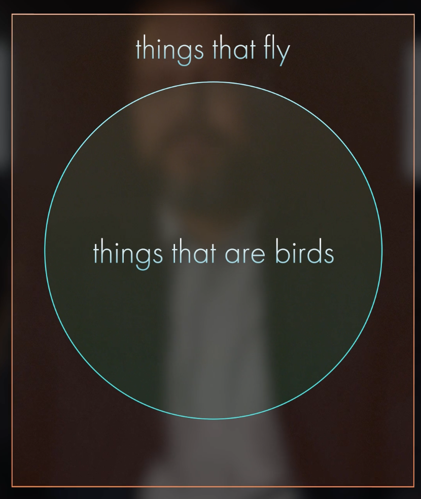
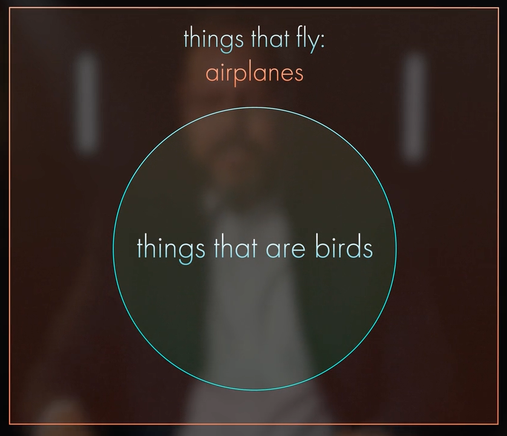

# Mathematics and Logic: From Euclid to Modern Geometry
https://online.hillsdale.edu/courses/mathematics-and-logic-from-euclid-to-modern-geometry

### Table of Contents

> * [Lesson 1. Mathematics and Liberal Education](#lesson-1-mathematics-and-liberal-education)
> * [Lesson 2. The Fundamentals of Logic](#lesson-2-the-fundamentals-of-logic)
> * [Lesson 2 Quiz](#lesson-2-quiz)
> * [Lesson 3. Deductive Reasoning and the Transformation of Mathematics](#lesson-3-deductive-reasoning-and-the-transformation-of-mathematics)
> * [Lesson 3 Quiz](#lesson-3-quiz)
> * [Lesson 4. Begin at the Beginning: Teh Axioms aog Euclidean Geometry](#lesson-4-begin-at-the-beginning-teh-axioms-aog-euclidean-geometry)
> * [Lesson 4 Quiz](#lesson-4-quiz)
> * [Lesson 5. Neutral Geometry: The Early Propositions of Euclid's Elements](#lesson-5-neutral-geometry-the-early-propositions-of-euclids-elements)
> * [Lesson 5 Quiz](#lesson-5-quiz)
> * [Lesson 6. Euclid's Fifth Postulate](#lesson-6-euclids-fifth-postulate)
> * [Lesson 6 Quiz](#lesson-6-quiz)
> * [Lesson 7. Euclid's Proof of the Pythagorean theorem](#lesson-7-euclids-proof-of-the-pythagorean-theorem)
> * [Lesson 7 Quiz](#lesson-7-quiz)
> * [Lesson 8. Number Theory and Solid Geometry in the Elements](#lesson-8-number-theory-and-solid-geometry-in-the-elements)
> * [Lesson 8 Quiz](#lesson-8-quiz)
> * [Lesson 9. Euler and the Birth of a New Geometry](#lesson-9-euler-and-the-birth-of-a-new-geometry)
> * [Lesson 9 Quiz](#lesson-9-quiz)
> * [Lesson 10. The History of the Fifth Postulate](#lesson-10-the-history-of-the-fifth-postulate)
> * [Lesson 10](#lesson-10)
> * [Lesson 11. Non-Euclidean Geometry](#lesson-11-non-euclidean-geometry)
> * [Lesson 11 Quiz](#lesson-11-quiz)
> * [Final Quiz](#final-quiz)

*** 

## Lesson 1. Mathematics and Liberal Education

## Lesson 2. The Fundamentals of Logic

### Statement
Statement = a sentence that is either true or false

- a question is not a statement
- we should be able to assign a truth value to it
- either true or false, not both, and not either 

Examples of statements

    The hat is red.

    The program failed.

### Negation
Negation = a statement that contains the opposite truth value of another statement.

    Statement:      The hat is red.
    Negation:       The hat is not red.

    Statement:      The program failed.
    Negation:       The program did not fail.

    Statement:      All men are mortal.
    Negation:       Some man is mortal.

    Statement:      The base anles are equal.
    Negation:       The base anles are not equal.

### Implications (if - then statements)
Examples of implications

    Statement 1:    It is a bird.
    Statement 2:    It flies.
    Implication:    If it is a bird, then it flies.

If P, then Q. / P implies Q.
* P - antecedent
* Q - consequent 

### Converse Statement
- Original statement: If Q, then P
- Converse statement: If P, then Q.

     If it flies, then it is a bird.
 
Converse is not logically equivalent to implication:

## Lesson 2 Quiz
## Lesson 3. Deductive Reasoning and the Transformation of Mathematics
## Lesson 3 Quiz
## Lesson 4. Begin at the Beginning: Teh Axioms aog Euclidean Geometry
## Lesson 4 Quiz
## Lesson 5. Neutral Geometry: The Early Propositions of Euclid's Elements
## Lesson 5 Quiz
## Lesson 6. Euclid's Fifth Postulate.
## Lesson 6 Quiz
## Lesson 7. Euclid's Proof of the Pythagorean theorem
## Lesson 7 Quiz
## Lesson 8. Number Theory and Solid Geometry in the Elements
## Lesson 8 Quiz
## Lesson 9. Euler and the Birth of a New Geometry.
## Lesson 9 Quiz
## Lesson 10. The History of the Fifth Postulate
## Lesson 10
## Lesson 11. Non-Euclidean Geometry
## Lesson 11 Quiz
## Final Quiz